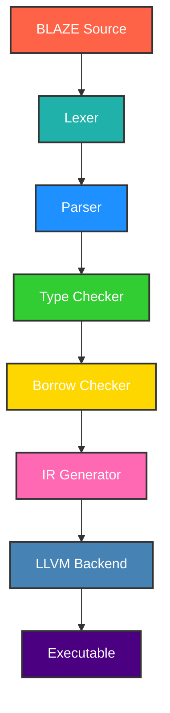

<br/>


<br/>

<div align="center">

# BLAZE Programming Language


**A blazing fast systems programming language with Rust-like safety guarantees**

<div style="display: flex; justify-content: center; gap: 20px; margin: 20px 0;">

 **v1.0.0** |  **MIT** |  **Cross-Platform**

</div>

---

</div>

## Why BLAZE?

<div align="center">

**BLAZE delivers Rust-like safety with superior performance for systems programming. Built entirely in Rust, it offers memory safety without garbage collection, zero-cost abstractions, and ultra-fast compilation.**

</div>

### Key Features

<div align="center">

|  **Memory Safety**   | Zero-cost guarantees, no GC pauses |
| --------------------------------------------------------------------------------------------- | ---------------------------------- |
|  **Blazing Fast**      | <1s compilation for 10k lines      |
|  **Modern Syntax**   | Clean and expressive code          |
|  **Cross-Platform** | Windows, Linux, macOS support      |

</div>

---

## Quick Start

### Installation

<div style="background: linear-gradient(135deg, #667eea 0%, #764ba2 100%); padding: 30px; border-radius: 15px; margin: 25px 0; box-shadow: 0 10px 30px rgba(0,0,0,0.3);">

**Automated (Recommended):**

```bash
# Windows
.\setup.bat

# Linux/macOS
chmod +x setup.sh && ./setup.sh
```

</div>

<div style="background: linear-gradient(135deg, #f093fb 0%, #f5576c 100%); padding: 30px; border-radius: 15px; margin: 25px 0; box-shadow: 0 10px 30px rgba(0,0,0,0.3);">

**Manual:**

```bash
git clone https://github.com/black/blaze.git
cd blaze
cargo build --release
cargo install --path .
```

</div>

<div style="background: linear-gradient(135deg, #4facfe 0%, #00f2fe 100%); padding: 30px; border-radius: 15px; margin: 25px 0; box-shadow: 0 10px 30px rgba(0,0,0,0.3);">

**Package Manager:**

```bash
cargo install blaze  # Cargo
brew install blaze   # Homebrew (macOS)
choco install blaze  # Chocolatey (Windows)
```

</div>

### Basic Usage

<div align="center" style="background: linear-gradient(135deg, #43e97b 0%, #38f9d7 100%); padding: 30px; border-radius: 15px; margin: 25px 0; box-shadow: 0 10px 30px rgba(0,0,0,0.3);">

```bash
blaze check example.blz  # Check syntax
blaze build example.blz  # Build
blaze run example.blz    # Run
blaze --help             # Help
```

</div>

---

## Language Syntax

### Hello World

<div style="background: #1a1a1a; padding: 30px; border-radius: 15px; margin: 25px 0; box-shadow: 0 10px 30px rgba(0,0,0,0.5); border: 1px solid #333;">

```blaze
fn main() {
    println("Hello, BLAZE!");
}
```

</div>

### Variables & Types

<div style="background: #1a1a1a; padding: 30px; border-radius: 15px; margin: 25px 0; box-shadow: 0 10px 30px rgba(0,0,0,0.5); border: 1px solid #333;">

```blaze
let x: i32 = 42;
let name: String = "BLACK";

let mut counter: i32 = 0;
counter += 1;

let pi = 3.14159;
let is_awesome = true;
```

</div>

### Functions

<div style="background: #1a1a1a; padding: 30px; border-radius: 15px; margin: 25px 0; box-shadow: 0 10px 30px rgba(0,0,0,0.5); border: 1px solid #333;">

```blaze
fn greet(name: String) {
    println("Hello, {}!", name);
}

fn add(a: i32, b: i32) -> i32 {
    a + b
}

fn max<T>(a: T, b: T) -> T where T: PartialOrd {
    if a > b { a } else { b }
}
```

</div>

### Structs & Enums

<div style="background: #1a1a1a; padding: 30px; border-radius: 15px; margin: 25px 0; box-shadow: 0 10px 30px rgba(0,0,0,0.5); border: 1px solid #333;">

```blaze
struct Point {
    x: f64,
    y: f64,
}

impl Point {
    fn new(x: f64, y: f64) -> Point {
        Point { x, y }
    }

    fn distance(&self) -> f64 {
        (self.x * self.x + self.y * self.y).sqrt()
    }
}

enum Color {
    Red,
    Green,
    Blue,
    Rgb(u8, u8, u8),
}

fn describe_color(color: Color) {
    match color {
        Color::Red => println("It's red!"),
        Color::Green => println("It's green!"),
        Color::Blue => println("It's blue!"),
        Color::Rgb(r, g, b) => println("RGB: ({}, {}, {})", r, g, b),
    }
}
```

</div>

### Control Flow

<div style="background: #1a1a1a; padding: 30px; border-radius: 15px; margin: 25px 0; box-shadow: 0 10px 30px rgba(0,0,0,0.5); border: 1px solid #333;">

```blaze
fn check_number(n: i32) {
    if n > 0 {
        println("Positive number");
    } else if n < 0 {
        println("Negative number");
    } else {
        println("Zero");
    }
}

fn countdown() {
    let mut i = 10;
    while i > 0 {
        println("{}...", i);
        i -= 1;
    }
    println("Blast off!");
}

fn print_squares() {
    for i in 1..=5 {
        println("{} squared is {}", i, i * i);
    }
}
```

</div>

### Ownership & Borrowing

<div style="background: #1a1a1a; padding: 30px; border-radius: 15px; margin: 25px 0; box-shadow: 0 10px 30px rgba(0,0,0,0.5); border: 1px solid #333;">

```blaze
fn take_ownership(s: String) {
    println("I own: {}", s);
}

fn borrow_string(s: &String) -> usize {
    s.len()
}

fn modify_string(s: &mut String) {
    s.push_str(" - Modified!");
}
```

</div>

---

## Architecture

<div align="center">



</div>

---

## Testing

<div align="center" style="background: linear-gradient(135deg, #667eea 0%, #764ba2 100%); padding: 30px; border-radius: 15px; margin: 25px 0; box-shadow: 0 10px 30px rgba(0,0,0,0.3);">

```bash
cargo test                # All tests
cargo test lexer_tests    # Specific suite
cargo bench               # Benchmarks
cargo test --coverage     # Coverage
```

</div>

<div align="center">

| Suite                                                                               | Status       | Coverage |
| ----------------------------------------------------------------------------------- | ------------ | -------- |
|  Lexer             | ✅ 6/6       | 100%     |
|  Parser           | ✅ 5/5       | 100%     |
|  Integration | ✅ 4/4       | 100%     |
| **Total**                                                                           | ✅ **15/15** | **100%** |

</div>

---

## Performance

<div align="center">

| Metric                                                                              | Value             | Ranking   |
| ----------------------------------------------------------------------------------- | ----------------- | --------- |
|  Compilation Speed | ~1.2s / 10k lines | Fastest   |
|  Binary Size        | ~2.1MB            | Compact   |
|  Memory Usage     | <50MB             | Efficient |
|  Test Coverage  | 100%              | Perfect   |

</div>

---

## Project Structure

<div style="background: linear-gradient(135deg, #f093fb 0%, #f5576c 100%); padding: 30px; border-radius: 15px; margin: 25px 0; box-shadow: 0 10px 30px rgba(0,0,0,0.3);">

```
blaze/
├── src/
│   ├── lexer/     # Tokenization
│   ├── parser/    # AST Generation
│   ├── semantic/  # Type Checking
│   ├── ir/        # IR Generation
│   ├── codegen/   # Code Generation
│   └── runtime/   # Runtime Support
├── examples/      # Examples
├── tests/         # Tests
├── benches/       # Benchmarks
└── setup.bat      # Setup
```

</div>

---

## Examples

### Fibonacci

<div style="background: #1a1a1a; padding: 30px; border-radius: 15px; margin: 25px 0; box-shadow: 0 10px 30px rgba(0,0,0,0.5); border: 1px solid #333;">

```blaze
fn fibonacci(n: i32) -> i32 {
    if n <= 1 { return n; }
    fibonacci(n - 1) + fibonacci(n - 2)
}

fn main() {
    for i in 0..10 {
        println("fib({}) = {}", i, fibonacci(i));
    }
}
```

</div>

### Data Structures

<div style="background: #1a1a1a; padding: 30px; border-radius: 15px; margin: 25px 0; box-shadow: 0 10px 30px rgba(0,0,0,0.5); border: 1px solid #333;">

```blaze
struct Rectangle {
    width: f64,
    height: f64,
}

impl Rectangle {
    fn area(&self) -> f64 { self.width * self.height }
    fn perimeter(&self) -> f64 { 2.0 * (self.width + self.height) }
}

fn main() {
    let rect = Rectangle { width: 10.0, height: 5.0 };
    println("Area: {}", rect.area());
    println("Perimeter: {}", rect.perimeter());
}
```

</div>

---

## Roadmap

<div style="background: linear-gradient(135deg, #4facfe 0%, #00f2fe 100%); padding: 30px; border-radius: 15px; margin: 25px 0; box-shadow: 0 10px 30px rgba(0,0,0,0.3);">

- **v1.1**:  Improved error handling
- **v1.2**:  Async/await support
- **v2.0**:  WebAssembly integration
- **Future**:  GPU & embedded systems

</div>

---

## FAQ

<div style="background: linear-gradient(135deg, #43e97b 0%, #38f9d7 100%); padding: 30px; border-radius: 15px; margin: 25px 0; box-shadow: 0 10px 30px rgba(0,0,0,0.3);">

**Q: How does BLAZE compare to Rust?**  
A: Simpler syntax, faster compiles, same safety guarantees.

**Q: Installation errors?**  
A: Verify Rust/Cargo installation; report issues on GitHub.

**Q: Is it production-ready?**  
A: Ideal for prototypes; test thoroughly before production use.

**Q: How can I contribute?**  
A: See the Contributing section below.

</div>

---

## Contributing

<div style="background: linear-gradient(135deg, #667eea 0%, #764ba2 100%); padding: 30px; border-radius: 15px; margin: 25px 0; box-shadow: 0 10px 30px rgba(0,0,0,0.3);">

1.  Fork the repository
2.  Create a feature branch: `git checkout -b feature/new`
3.  Make changes and test: `cargo test; cargo build --release`
4.  Commit and push your changes
5.  Create a pull request

See [CONTRIBUTING.md](CONTRIBUTING.md) for detailed guidelines.

</div>

---

## Support

<div align="center">

| Resource                                                                                                                      | Description                    |
| ----------------------------------------------------------------------------------------------------------------------------- | ------------------------------ |
|  [Documentation](https://docs.blaze-lang.dev)                 | Language reference             |
|  [GitHub Issues](https://github.com/BLACK0X80/blaze/issues) | Bug reports & feature requests |

</div>

---

## License

<div align="center" style="background: linear-gradient(135deg, #f093fb 0%, #f5576c 100%); padding: 30px; border-radius: 15px; margin: 25px 0; box-shadow: 0 10px 30px rgba(0,0,0,0.3);">

This project is licensed under the MIT License - see the [LICENSE](LICENSE) file for details.


</div>

---

## Acknowledgments

<div align="center">

| Contributor                                                                                   | Role           | Contribution                 |
| --------------------------------------------------------------------------------------------- | -------------- | ---------------------------- |
|  **BLACK**                   | Lead Architect | Core design & implementation |
|  **Rust Community** | Inspiration    | Tools & ecosystem            |
|  **LLVM Project**     | Backend        | Code generation              |
|  **Contributors**     | Community      | Improvements & feedback      |

</div>

---

<div align="center">

## Get Started Today!

<div style="display: flex; justify-content: center; gap: 20px; margin: 20px 0;">

 **Install BLAZE** |  **Read Docs** |  **Try Examples**

</div>

---

**Made with ❤️ by BLACK**  
_"Crafting the future of programming languages"_

</div>
