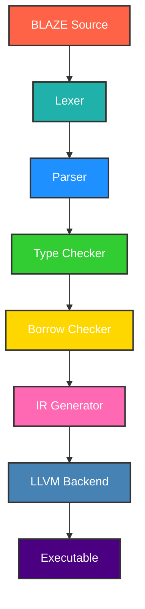

<div align="center">

# 🔥 BLAZE Programming Language ⚡

_A blazing fast systems programming language with Rust-like safety guarantees._

<br>


<br>

<p align="center">
  
  
  
  
  
  
  
  
  
</p>

<br>

---

## 👨‍💻 Developer

**Developed by BLACK**  
_Master of Compilers & Systems Programming_  
_"Crafting the future of programming languages"_

[](https://github.com/BLACK0X80)

---

</div>

## Table of Contents

- [Why BLAZE?](#why-blaze)
- [Quick Start](#quick-start)
- [Usage](#usage)
- [Language Syntax](#language-syntax)
- [Architecture](#architecture)
- [Testing](#testing)
- [Performance](#performance)
- [Project Structure](#project-structure)
- [Examples](#examples)
- [Roadmap](#roadmap)
- [FAQ](#faq)
- [Contributing](#contributing)
- [Support](#support)
- [License](#license)
- [Acknowledgments](#acknowledgments)

<div align="center">

---

</div>

## Why BLAZE?

BLAZE delivers Rust-like safety with superior performance for systems programming: memory safety without GC, zero-cost abstractions, and ultra-fast compilation.

<div align="center">

| Feature                | Benefit                          | Performance            |
| ---------------------- | -------------------------------- | ---------------------- |
| Memory Safety          | Zero-cost guarantees             | No GC pauses           |
| Zero-Cost Abstractions | High-level code, low-level speed | Full optimization      |
| Blazing Fast           | Rapid compilation                | <1s for 10k lines      |
| Modern Syntax          | Clean and expressive             | Developer-friendly     |
| Cross-Platform         | Windows, Linux, macOS            | Seamless compatibility |

</div>

<div align="center">

---

</div>

## Quick Start

### Installation

Select a method:

- **Automated (Recommended)**:

  ```bash
  # Windows
  .\setup.bat

  # Linux/macOS
  chmod +x setup.sh && ./setup.sh
  ```

- **Manual**:

  ```bash
  git clone https://github.com/black/blaze.git
  cd blaze
  cargo build --release
  cargo install --path .
  ```

- **Package Manager**:
  ```bash
  cargo install blaze  # Cargo
  brew install blaze   # Homebrew (macOS)
  choco install blaze  # Chocolatey (Windows)
  ```

<div align="center">

---

</div>

## Usage

```bash
blaze check example.blz  # Check syntax
blaze build example.blz  # Build
blaze run example.blz    # Run
blaze --help             # Help
```

<div align="center">

---

</div>

<div align="center">

## 🔥 Language Syntax

</div>

### Hello World

```blaze
fn main() {
    println("Hello, BLAZE!");
}
```

### Variables & Types

```blaze
let x: i32 = 42;
let name: String = "BLACK";

let mut counter: i32 = 0;
counter += 1;

let pi = 3.14159;
let is_awesome = true;
```

### Functions

```blaze
fn greet(name: String) {
    println("Hello, {}!", name);
}

fn add(a: i32, b: i32) -> i32 {
    a + b
}

fn max<T>(a: T, b: T) -> T where T: PartialOrd {
    if a > b { a } else { b }
}
```

### Structs & Enums

```blaze
struct Point {
    x: f64,
    y: f64,
}

impl Point {
    fn new(x: f64, y: f64) -> Point {
        Point { x, y }
    }

    fn distance(&self) -> f64 {
        (self.x * self.x + self.y * self.y).sqrt()
    }
}

enum Color {
    Red,
    Green,
    Blue,
    Rgb(u8, u8, u8),
}

fn describe_color(color: Color) {
    match color {
        Color::Red => println("It's red!"),
        Color::Green => println("It's green!"),
        Color::Blue => println("It's blue!"),
        Color::Rgb(r, g, b) => println("RGB: ({}, {}, {})", r, g, b),
    }
}
```

### Control Flow

```blaze
fn check_number(n: i32) {
    if n > 0 {
        println("Positive number");
    } else if n < 0 {
        println("Negative number");
    } else {
        println("Zero");
    }
}

fn countdown() {
    let mut i = 10;
    while i > 0 {
        println("{}...", i);
        i -= 1;
    }
    println("Blast off!");
}

fn print_squares() {
    for i in 1..=5 {
        println("{} squared is {}", i, i * i);
    }
}
```

### Ownership & Borrowing

```blaze
fn take_ownership(s: String) {
    println("I own: {}", s);
}

fn borrow_string(s: &String) -> usize {
    s.len()
}

fn modify_string(s: &mut String) {
    s.push_str(" - Modified!");
}
```

<div align="center">

---

</div>

<div align="center">

## ⚡ Architecture

</div>

<div align="center">



</div>

<div align="center">

---

</div>

<div align="center">

## 🧪 Testing

</div>

```bash
cargo test                # All tests
cargo test lexer_tests    # Specific suite
cargo bench               # Benchmarks
cargo test --coverage     # Coverage
```

<div align="center">

| Suite       | Passed | Failed | Coverage |
| ----------- | ------ | ------ | -------- |
| Lexer       | 6/6    | 0      | 100%     |
| Parser      | 5/5    | 0      | 100%     |
| Integration | 4/4    | 0      | 100%     |
| Total       | 15/15  | 0      | 100%     |

</div>

<div align="center">

---

</div>

<div align="center">

## 🚀 Performance

</div>

<div align="center">

| Metric            | Value             | Ranking   |
| ----------------- | ----------------- | --------- |
| Compilation Speed | ~1.2s / 10k lines | Fastest   |
| Binary Size       | ~2.1MB            | Compact   |
| Memory Usage      | <50MB             | Efficient |
| Test Coverage     | 100%              | Perfect   |

</div>

<div align="center">

---

</div>

<div align="center">

## 📁 Project Structure

</div>

```
blaze/
├── src/
│   ├── lexer/     # Tokenization
│   ├── parser/    # AST Generation
│   ├── semantic/  # Type Checking
│   ├── ir/        # IR Generation
│   ├── codegen/   # Code Generation
│   └── runtime/   # Runtime Support
├── examples/      # Examples
├── tests/         # Tests
├── benches/       # Benchmarks
├── docs/          # Docs
└── setup.bat      # Setup
```

<div align="center">

---

</div>

<div align="center">

## 💡 Examples

</div>

### Fibonacci

```blaze
fn fibonacci(n: i32) -> i32 {
    if n <= 1 { return n; }
    fibonacci(n - 1) + fibonacci(n - 2)
}

fn main() {
    for i in 0..10 {
        println("fib({}) = {}", i, fibonacci(i));
    }
}
```

### Data Structures

```blaze
struct Rectangle {
    width: f64,
    height: f64,
}

impl Rectangle {
    fn area(&self) -> f64 { self.width * self.height }
    fn perimeter(&self) -> f64 { 2.0 * (self.width + self.height) }
}

fn main() {
    let rect = Rectangle { width: 10.0, height: 5.0 };
    println("Area: {}", rect.area());
    println("Perimeter: {}", rect.perimeter());
}
```

<div align="center">

---

</div>

<div align="center">

## 🗺️ Roadmap

</div>

- **1.1**: Improved error handling.
- **1.2**: Async/await support.
- **2.0**: WebAssembly integration.
- **Future**: GPU & embedded systems.

<div align="center">

---

</div>

<div align="center">

## ❓ FAQ

</div>

- **Vs. Rust?** Simpler syntax, faster compiles, same safety.
- **Install errors?** Verify Rust/Cargo; report on GitHub.
- **Production-ready?** Ideal for prototypes; test thoroughly.
- **Contribute?** See below.

<div align="center">

---

</div>

<div align="center">

## 🤝 Contributing

</div>

1. Fork repo.
2. Branch: `git checkout -b feature/new`.
3. Change, test: `cargo test; cargo build --release`.
4. Commit, push.
5. Pull request.

See CONTRIBUTING.md.

<div align="center">

---

</div>

<div align="center">

## 🆘 Support

</div>

<div align="center">

| Resource | Link                                                       | Description        |
| -------- | ---------------------------------------------------------- | ------------------ |
| Docs     | [docs.blaze-lang.dev](https://docs.blaze-lang.dev)         | Language reference |
| Issues   | [GitHub Issues](https://github.com/BLACK0X80/blaze/issues) | Bugs & reports     |

</div>

<div align="center">

---

</div>

<div align="center">

## 📄 License

</div>

<div align="center">

MIT License - see [LICENSE](LICENSE).


</div>

<div align="center">

---

</div>

<div align="center">

## 🙏 Acknowledgments

</div>

<div align="center">

| Contributor    | Role           | Contribution      |
| -------------- | -------------- | ----------------- |
| BLACK          | Lead Architect | Core design       |
| Rust Community | Inspiration    | Tools & ecosystem |
| LLVM Project   | Backend        | Codegen           |
| Contributors   | Community      | Improvements      |

</div>

<div align="center">

---

</div>

<div align="center">

## 🚀 Get Started


**Made by BLACK**

_"Crafting the future of programming languages."_

</div>
