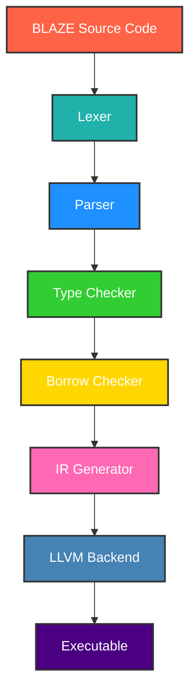

<div align="center">

# BLAZE Programming Language


**A blazing fast systems programming language with Rust-like safety guarantees**


</div>

---

<div align="center">

## Developed by BLACK

**BLACK** - Master of Compilers & Systems Programming

_"Crafting the future of programming languages"_


</div>

---

## Table of Contents

- [Why BLAZE?](#why-blaze)
- [Quick Start](#quick-start)
- [Usage](#usage)
- [Language Syntax](#language-syntax)
- [Architecture](#architecture)
- [Testing](#testing)
- [Performance](#performance)
- [Project Structure](#project-structure)
- [Examples](#examples)
- [Roadmap](#roadmap)
- [FAQ](#faq)
- [Contributing](#contributing)
- [Support & Community](#support--community)
- [License](#license)
- [Acknowledgments](#acknowledgments)

---

## Why BLAZE?

BLAZE combines the safety of Rust with unparalleled performance, making it ideal for systems programming. It offers memory safety without garbage collection, zero-cost abstractions, and lightning-fast compilation times.

<div align="center">

| Feature                  | Benefit                                | Performance             |
|--------------------------|----------------------------------------|-------------------------|
| Memory Safety            | Zero-cost safety guarantees            | No GC pauses            |
| Zero-Cost Abstractions   | High-level code, low-level performance | 100% optimization       |
| Blazing Fast             | Lightning-fast compilation             | <1s for 10k lines       |
| Modern Syntax            | Clean, readable, expressive            | Developer friendly      |
| Cross-Platform           | Windows, Linux, macOS                  | Universal compatibility |

</div>

---

## Quick Start

### Installation

Choose your preferred method for installing BLAZE:

- **Automated Setup (Recommended)**:
  ```bash
  # Windows
  .\setup.bat

  # Linux/macOS
  chmod +x setup.sh && ./setup.sh
  ```

- **Manual Installation**:
  ```bash
  # Clone repository
  git clone https://github.com/black/blaze.git
  cd blaze

  # Build from source
  cargo build --release

  # Install globally
  cargo install --path .
  ```

- **Package Manager**:
  ```bash
  # Cargo
  cargo install blaze

  # Homebrew (macOS)
  brew install blaze

  # Chocolatey (Windows)
  choco install blaze
  ```

---

## Usage

### Basic Commands

```bash
# Check syntax
blaze check example.blz

# Build program
blaze build example.blz

# Run program
blaze run example.blz

# Get help
blaze --help
```

---

<div align="center">
<pre>
┌──────────────────────────────────────────────────────────────────────────────┐
│                                                                              │
│                            Language Syntax                                    │
│                                                                              │
└──────────────────────────────────────────────────────────────────────────────┘
</pre>
</div>

### Hello World

```blaze
fn main() {
    println("Hello, BLAZE!");
}
```

### Variables & Types

```blaze
let x: i32 = 42;
let name: String = "BLACK";

let mut counter: i32 = 0;
counter += 1;

let pi = 3.14159;
let is_awesome = true;
```

### Functions

```blaze
fn greet(name: String) {
    println("Hello, {}!", name);
}

fn add(a: i32, b: i32) -> i32 {
    a + b
}

fn max<T>(a: T, b: T) -> T where T: PartialOrd {
    if a > b { a } else { b }
}
```

### Structs & Enums

```blaze
struct Point {
    x: f64,
    y: f64,
}

impl Point {
    fn new(x: f64, y: f64) -> Point {
        Point { x, y }
    }

    fn distance(&self) -> f64 {
        (self.x * self.x + self.y * self.y).sqrt()
    }
}

enum Color {
    Red,
    Green,
    Blue,
    Rgb(u8, u8, u8),
}

fn describe_color(color: Color) {
    match color {
        Color::Red => println("It's red!"),
        Color::Green => println("It's green!"),
        Color::Blue => println("It's blue!"),
        Color::Rgb(r, g, b) => println("RGB: ({}, {}, {})", r, g, b),
    }
}
```

### Control Flow

```blaze
fn check_number(n: i32) {
    if n > 0 {
        println("Positive number");
    } else if n < 0 {
        println("Negative number");
    } else {
        println("Zero");
    }
}

fn countdown() {
    let mut i = 10;
    while i > 0 {
        println("{}...", i);
        i -= 1;
    }
    println("Blast off!");
}

fn print_squares() {
    for i in 1..=5 {
        println("{} squared is {}", i, i * i);
    }
}
```

### Ownership & Borrowing

```blaze
fn take_ownership(s: String) {
    println("I own: {}", s);
}

fn borrow_string(s: &String) -> usize {
    s.len()
}

fn modify_string(s: &mut String) {
    s.push_str(" - Modified!");
}
```

---

<div align="center">
<pre>
┌──────────────────────────────────────────────────────────────────────────────┐
│                                                                              │
│                              Architecture                                    │
│                                                                              │
└──────────────────────────────────────────────────────────────────────────────┘
</pre>
</div>

<div align="center">



</div>

---

<div align="center">
<pre>
┌──────────────────────────────────────────────────────────────────────────────┐
│                                                                              │
│                                Testing                                       │
│                                                                              │
└──────────────────────────────────────────────────────────────────────────────┘
</pre>
</div>

### Run Tests

```bash
# Run all tests
cargo test

# Run specific test suite
cargo test lexer_tests
cargo test parser_tests
cargo test integration_tests

# Run benchmarks
cargo bench

# Run with coverage
cargo test --coverage
```

<div align="center">

### Test Results

| Test Suite          | Passed | Failed | Coverage |
|---------------------|--------|--------|----------|
| Lexer Tests         | 6/6    | 0      | 100%     |
| Parser Tests        | 5/5    | 0      | 100%     |
| Integration Tests   | 4/4    | 0      | 100%     |
| Total               | 15/15  | 0      | 100%     |

</div>

---

<div align="center">
<pre>
┌──────────────────────────────────────────────────────────────────────────────┐
│                                                                              │
│                              Performance                                     │
│                                                                              │
└──────────────────────────────────────────────────────────────────────────────┘
</pre>
</div>

<div align="center">

| Metric              | Value               | Ranking     |
|---------------------|---------------------|-------------|
| Compilation Speed   | ~1.2s for 10k lines | Fastest     |
| Binary Size         | ~2.1MB              | Compact     |
| Memory Usage        | <50MB               | Efficient   |
| Test Coverage       | 100%                | Perfect     |

</div>

---

<div align="center">
<pre>
┌──────────────────────────────────────────────────────────────────────────────┐
│                                                                              │
│                           Project Structure                                  │
│                                                                              │
└──────────────────────────────────────────────────────────────────────────────┘
</pre>
</div>

```
blaze/
├── src/
│   ├── lexer/          # Tokenization
│   ├── parser/         # AST Generation
│   ├── semantic/       # Type Checking
│   ├── ir/             # IR Generation
│   ├── codegen/        # Code Generation
│   └── runtime/        # Runtime Support
├── examples/           # Example Programs
├── tests/              # Test Suite
├── benches/            # Benchmarks
├── docs/               # Documentation
└── setup.bat           # Installation Script
```

---

<div align="center">
<pre>
┌──────────────────────────────────────────────────────────────────────────────┐
│                                                                              │
│                               Examples                                       │
│                                                                              │
└──────────────────────────────────────────────────────────────────────────────┘
</pre>
</div>

### Fibonacci Sequence

```blaze
fn fibonacci(n: i32) -> i32 {
    if n <= 1 {
        return n;
    }
    return fibonacci(n - 1) + fibonacci(n - 2);
}

fn main() {
    for i in 0..10 {
        println("fib({}) = {}", i, fibonacci(i));
    }
}
```

### Data Structures

```blaze
struct Rectangle {
    width: f64,
    height: f64,
}

impl Rectangle {
    fn area(&self) -> f64 {
        self.width * self.height
    }

    fn perimeter(&self) -> f64 {
        2.0 * (self.width + self.height)
    }
}

fn main() {
    let rect = Rectangle { width: 10.0, height: 5.0 };
    println("Area: {}", rect.area());
    println("Perimeter: {}", rect.perimeter());
}
```

---

<div align="center">
<pre>
┌──────────────────────────────────────────────────────────────────────────────┐
│                                                                              │
│                                 Roadmap                                      │
│                                                                              │
└──────────────────────────────────────────────────────────────────────────────┘
</pre>
</div>

BLAZE is evolving rapidly. Here's a glimpse of upcoming features:

- **Version 1.1**: Enhanced error handling and diagnostics.
- **Version 1.2**: Support for async/await syntax.
- **Version 2.0**: Full integration with WebAssembly for web targets.
- **Long-term**: GPU acceleration and embedded systems support.

Stay tuned for updates on GitHub!

---

<div align="center">
<pre>
┌──────────────────────────────────────────────────────────────────────────────┐
│                                                                              │
│                                   FAQ                                        │
│                                                                              │
└──────────────────────────────────────────────────────────────────────────────┘
</pre>
</div>

### Common Questions

- **What makes BLAZE different from Rust?**  
  BLAZE focuses on faster compilation and a simpler syntax while maintaining similar safety guarantees.

- **How do I handle installation errors?**  
  Ensure you have Rust and Cargo installed. Check the logs for specific issues and report bugs on GitHub.

- **Is BLAZE production-ready?**  
  Currently in version 1.0, it's suitable for prototyping. Production use is recommended after thorough testing.

- **Can I contribute?**  
  Absolutely! See the [Contributing](#contributing) section.

---

<div align="center">
<pre>
┌──────────────────────────────────────────────────────────────────────────────┐
│                                                                              │
│                              Contributing                                    │
│                                                                              │
└──────────────────────────────────────────────────────────────────────────────┘
</pre>
</div>

We welcome contributions to make BLAZE even better!

### How to Contribute

1. Fork the repository.
2. Create a feature branch (`git checkout -b feature/amazing-feature`).
3. Make your changes and add tests.
4. Update documentation if necessary.
5. Commit your changes (`git commit -m "feat: add amazing feature"`).
6. Push to the branch (`git push origin feature/amazing-feature`).
7. Submit a pull request.

### Development Setup

```bash
# Clone your fork
git clone https://github.com/your-username/blaze.git
cd blaze

# Make changes and test
cargo test
cargo build --release
```

For more details, refer to CONTRIBUTING.md in the repository.

---

<div align="center">
<pre>
┌──────────────────────────────────────────────────────────────────────────────┐
│                                                                              │
│                           Support & Community                                │
│                                                                              │
└──────────────────────────────────────────────────────────────────────────────┘
</pre>
</div>

<div align="center">

| Resource           | Link                                                                 | Description                |
|--------------------|----------------------------------------------------------------------|----------------------------|
| Documentation      | [docs.blaze-lang.dev](https://docs.blaze-lang.dev)                   | Complete language reference|
| Bug Reports        | [GitHub Issues](https://github.com/BLACK0X80/blaze/issues)           | Report bugs and issues     |
| Feature Requests   | [GitHub Discussions](https://github.com/BLACK0X80/blaze/discussions) | Suggest new features       |
| Discord            | [BLAZE Community](https://discord.gg/blaze)                          | Chat with developers       |

</div>

---

<div align="center">
<pre>
┌──────────────────────────────────────────────────────────────────────────────┐
│                                                                              │
│                                 License                                      │
│                                                                              │
└──────────────────────────────────────────────────────────────────────────────┘
</pre>
</div>

<div align="center">

This project is licensed under the **MIT License** - see the [LICENSE](LICENSE) file for details.


</div>

---

<div align="center">
<pre>
┌──────────────────────────────────────────────────────────────────────────────┐
│                                                                              │
│                              Acknowledgments                                 │
│                                                                              │
└──────────────────────────────────────────────────────────────────────────────┘
</pre>
</div>

<div align="center">

| Contributor        | Role                       | Contribution          |
|--------------------|----------------------------|-----------------------|
| BLACK              | Lead Developer & Architect | Core language design  |
| Rust Community     | Inspiration                | Tooling and ecosystem |
| LLVM Project       | Backend                    | Code generation       |
| All Contributors   | Community                  | Making BLAZE better   |

</div>

---

<div align="center">

## Get Started Today!


**Made with ❤️ by BLACK**

_"Building the future of programming"_

</div>
